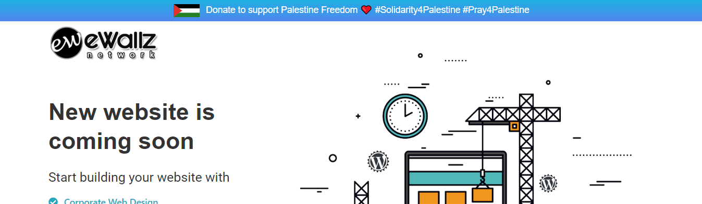

# Zero setup banner for websites to show support for Palestine

Use this snippet to show your support for Palestine on the top of your website. Installing it takes minutes.

1. [About](#about)
1. [Installation](#installation)
1. [Multilingual version](#multilingual-version)
1. [Reporting issues](#reporting-issues)

## About

This code adds a small black banner on top of your website with Palestine flag and support message. It links to Aman Palestine donation site but you can change the link to point to a support channel of your choice.

Even though the banner has been tested on multiple websites it has some issues for example on sites with sticky navigation.



## Installation

Installation is dead simple. Just copy this code to your template right before the closing `<body>` tag.

```
<script>
// Support Palestine Banner by eWallz
function createBanner() {
  // Create the banner container
  var banner = document.createElement('a');
  banner.className = 'support-palestine';
  banner.href = 'https://jommenyumbang.com/ms/home';// set your link here
  banner.target = '_blank'; // Open the link in a new tab

  // set your text here
  var bannerContent = `
    <div class="support-palestine-flag" role="img" aria-label="Flag of Palestine">
      <svg xmlns="http://www.w3.org/2000/svg" width="40" height="20" viewBox="0 0 1000 500">
        <path fill="#000000" d="M 0.5,-0.5 C 333.5,-0.5 666.5,-0.5 999.5,-0.5C 999.5,55.1667 999.5,110.833 999.5,166.5C 740.43,166.832 481.43,166.499 222.5,165.5C 147.785,111.14 73.7851,55.8071 0.5,-0.5 Z"/>
        <path fill="#e3312b" d="M -0.5,-0.5 C -0.166667,-0.5 0.166667,-0.5 0.5,-0.5C 73.7851,55.8071 147.785,111.14 222.5,165.5C 223.475,167.193 224.808,168.693 226.5,170C 261.897,196.026 296.897,222.526 331.5,249.5C 295.481,277.191 259.481,304.857 223.5,332.5C 148.63,387.437 74.2969,443.103 0.5,499.5C 0.166667,499.5 -0.166667,499.5 -0.5,499.5C -0.5,332.833 -0.5,166.167 -0.5,-0.5 Z"/>
        <path fill="#fefefe" d="M 222.5,165.5 C 481.43,166.499 740.43,166.832 999.5,166.5C 999.5,221.833 999.5,277.167 999.5,332.5C 740.833,332.5 482.167,332.5 223.5,332.5C 259.481,304.857 295.481,277.191 331.5,249.5C 296.897,222.526 261.897,196.026 226.5,170C 224.808,168.693 223.475,167.193 222.5,165.5 Z"/>
        <path fill="#268024" d="M 223.5,332.5 C 482.167,332.5 740.833,332.5 999.5,332.5C 999.5,388.167 999.5,443.833 999.5,499.5C 666.5,499.5 333.5,499.5 0.5,499.5C 74.2969,443.103 148.63,387.437 223.5,332.5 Z"/>
      </svg>
    </div>
    <div class="support-palestine__label" style="color: white; margin-left: 10px; text-align: center;">
      Donate to support Palestine Freedom ❤️
      <span class="mobile-hidden">#Solidarity4Palestine #Pray4Palestine</span>
    </div>
  `;

  banner.innerHTML = bannerContent;

  // edit your color & styles here
  banner.style.position = 'fixed';
  banner.style.left = '0';
  banner.style.top = '0';
  banner.style.right = '0';
  banner.style.background = 'linear-gradient(rgb(28 178 226), rgb(80 134 238))'; // Gradient background
  banner.style.display = 'flex';
  banner.style.justifyContent = 'center';
  banner.style.paddingTop = '5px';
  banner.style.paddingBottom = '5px';
  banner.style.zIndex = '9999'; // Ensure the banner is above the header
  banner.style.textDecoration = 'none';
  banner.style.fontFamily = 'Arial';

  // Append the banner to the body
  document.body.appendChild(banner);

  // add element id - class to be shifted below banner (with !important to force it)
  var contentBelowBanner = document.querySelector('.navbar');
  if (contentBelowBanner) {
    contentBelowBanner.style.marginTop = '60px !important'; // Adjust the margin value as needed
  }

  // second text will be hidden on mobile
  var style = document.createElement('style');
  style.innerHTML = `
    @media (max-width: 768px) {
      .mobile-hidden {
        display: none;
      }
    }
  `;
  document.head.appendChild(style);
}

window.addEventListener('load', createBanner);
</script>
```

## Installation via Google Tag Manager

You can also easily install the banner with GTM.

1. Log into Tag Manager
1. Go to Tags view
1. Click New to add new tag
1. Set tag type to Custom HTML
1. Paste the snippet above to HTML field
1. Add All Pages trigger
1. Publish your changes


## Reporting issues

We are open for any feedback. Use GitHub [issue tracker](https://github.com/ewallz/stand-for-palestine/issues) to report issues.
